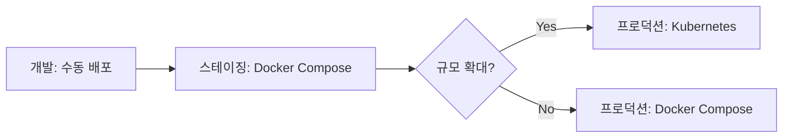

# Sentio 배포 방식 비교

> 업데이트: 2026-02-10

Sentio는 다양한 배포 방식을 지원합니다. 프로젝트 규모, 인프라 환경, 팀 역량에 따라 적합한 방식을 선택하세요.

---

## 📊 배포 옵션 비교표

| 특성 | Docker Compose | 수동 배포 | Kubernetes | 클라우드 PaaS |
|------|----------------|-----------|------------|---------------|
| **난이도** | ⭐⭐ | ⭐⭐⭐ | ⭐⭐⭐⭐⭐ | ⭐⭐⭐ |
| **초기 설정** | 5분 | 30분 | 2-4시간 | 15-30분 |
| **확장성** | ⭐⭐ | ⭐ | ⭐⭐⭐⭐⭐ | ⭐⭐⭐⭐ |
| **유지보수** | ⭐⭐⭐⭐ | ⭐⭐ | ⭐⭐⭐ | ⭐⭐⭐⭐⭐ |
| **비용** | 무료 (서버 費) | 무료 (서버 費) | 무료 (서버 費) | 💰 종량제 |
| **추천 환경** | 소규모, 개발/테스트 | 리소스 제약 | 대규모, 다중 사이트 | 빠른 배포 필요 |

---

## 1️⃣ Docker Compose (권장)

### ✅ 장점
- **간단한 설정**: 단일 명령어로 전체 스택 실행
- **일관성**: 개발/프로덕션 환경 동일
- **격리**: 호스트 시스템과 독립적
- **롤백 용이**: 이미지 버전 관리
- **의존성 관리**: 백엔드, 프론트엔드, DB를 하나의 compose로 관리

### ❌ 단점
- Docker 설치 필수
- 단일 서버 제한 (horizontal scaling 불가)
- 메모리/CPU가 제한적인 환경에서는 오버헤드

### 📦 사용 방법

```bash
# 1. .env 파일 설정
cp .env.example .env
nano .env  # 프로덕션 설정 적용

# 2. Docker Compose 실행
docker compose up -d --build

# 3. 로그 확인
docker compose logs -f

# 4. 중지
docker compose down
```

### 🎯 추천 대상
- **병원 1-3곳** 운영
- IT 인프라 팀이 있는 중소 의료기관
- 개발/스테이징 환경

---

## 2️⃣ 수동 배포 (VM/베어메탈)

### ✅ 장점
- **최소 리소스**: Docker 오버헤드 없음
- **세밀한 제어**: 모든 설정 직접 관리
- **레거시 통합**: 기존 시스템과 통합 용이

### ❌ 단점
- **복잡한 설정**: Python/Node/PostgreSQL/Nginx 등 개별 설정
- **의존성 충돌**: 호스트 시스템과 충돌 가능
- **업데이트 어려움**: 롤백 수동 관리

### 📦 사용 방법

#### Backend
```bash
cd backend

# Python 가상 환경
python3.11 -m venv venv
source venv/bin/activate  # Linux/Mac
# venv\Scripts\activate   # Windows

# 패키지 설치
pip install -r requirements.txt

# 마이그레이션
alembic upgrade head

# Gunicorn으로 실행 (프로덕션)
gunicorn app.main:app \
  -w 4 \
  -k uvicorn.workers.UvicornWorker \
  --bind 0.0.0.0:8001
```

#### Frontend
```bash
cd frontend

# 빌드
npm install
npm run build

# Nginx에 서빙 (dist/ 디렉터리)
```

#### Nginx 설정
```nginx
server {
    listen 80;
    server_name sentio.example.com;

    # Frontend
    location / {
        root /path/to/frontend/dist;
        try_files $uri /index.html;
    }

    # Backend API
    location /api/ {
        proxy_pass http://localhost:8001;
    }

    # WebSocket
    location /ws {
        proxy_pass http://localhost:8001;
        proxy_http_version 1.1;
        proxy_set_header Upgrade $http_upgrade;
        proxy_set_header Connection "upgrade";
    }
}
```

### 🎯 추천 대상
- **초소형 환경** (병원 1곳, 카메라 1-2대)
- 저사양 장비 (라즈베리 파이 등)
- Docker 설치 불가능한 환경

---

## 3️⃣ Kubernetes

### ✅ 장점
- **고가용성**: 자동 장애 복구
- **수평 확장**: 트래픽에 따라 자동 스케일링
- **멀티 사이트**: 여러 병원 통합 관리
- **롤링 업데이트**: 무중단 배포

### ❌ 단점
- **복잡도 극상**: 학습 곡선 가파름
- **관리 비용**: DevOps 전담 팀 필요
- **과도한 스펙**: 소규모 프로젝트에는 오버엔지니어링

### 📦 사용 방법

```yaml
# deployment.yaml (간략화)
apiVersion: apps/v1
kind: Deployment
metadata:
  name: sentio-backend
spec:
  replicas: 3
  selector:
    matchLabels:
      app: sentio-backend
  template:
    metadata:
      labels:
        app: sentio-backend
    spec:
      containers:
      - name: backend
        image: sentio/backend:latest
        ports:
        - containerPort: 8001
        env:
        - name: DATABASE_URL
          valueFrom:
            secretKeyRef:
              name: sentio-secrets
              key: database-url
```

### 🎯 추천 대상
- **대형 의료 그룹** (10+ 병원)
- 글로벌 배포
- 미션 크리티컬 (99.9% uptime 요구)

---

## 4️⃣ 클라우드 PaaS (Vercel/Railway/Render)

### ✅ 장점
- **즉시 배포**: Git Push만으로 자동 배포
- **인프라 관리 불필요**: 서버, 스케일링 자동
- **CDN 기본 제공**: 글로벌 캐싱
- **SSL 자동**: HTTPS 무료 제공

### ❌ 단점
- **비용**: 사용량 증가 시 고비용
- **WebSocket 제약**: 일부 PaaS에서 제한적
- **카메라 스트리밍 부적합**: WebRTC/MJPEG 처리 어려움
- **데이터 주권**: 의료 데이터 해외 저장 문제

### 📦 사용 방법

```bash
# Vercel (Frontend만)
vercel --prod

# Railway (Full Stack)
railway up
```

### 🎯 추천 대상
- **프로토타입/데모**
- Frontend만 배포 (Backend는 On-premise)
- 빠른 PoC 필요

---

## 🏆 Sentio 최종 권장 방식

### 케이스별 추천

#### 소규모 병원 (1-3개 병원, 카메라 2-10대)
**→ Docker Compose**
- 이유: 간단한 설정, 낮은 유지보수 비용
- 예상 리소스: CPU 4코어, RAM 8GB, SSD 50GB

#### 중규모 의료 그룹 (4-10개 병원, 카메라 10-50대)
**→ Docker Compose + Load Balancer**
- 이유: 각 병원 독립 운영 또는 중앙 집중형
- 고도화: Docker Swarm 고려

#### 대규모 병원 네트워크 (10+ 병원, 카메라 50+ 대)
**→ Kubernetes**
- 이유: 자동 확장, 고가용성, 멀티 리전
- 필수: DevOps 팀, 모니터링 시스템

#### 빠른 테스트/데모
**→ 수동 배포 (개발 모드)**
```bash
# Backend
cd backend
uvicorn app.main:app --reload

# Frontend
cd frontend
npm run dev
```

---

## 🔄 마이그레이션 경로



---

## 🛡️ 보안 고려사항 (모든 방식 공통)

1. **HTTPS 필수**: Let's Encrypt 사용
2. **방화벽 설정**: 8001 포트 제한
3. **환경 변수 암호화**: .env 파일 절대 Git 커밋 금지
4. **정기 업데이트**: 보안 패치 적용
5. **데이터 백업**: 매일 자동 백업 설정

---

## 📌 결론

| 환경 | 추천 방식 | 이유 |
|------|-----------|------|
| **개발/테스트** | Docker Compose | 간편, 일관성 |
| **소규모 프로덕션** | Docker Compose | 비용 효율, 유지보수 용이 |
| **대규모 프로덕션** | Kubernetes | 확장성, 고가용성 |
| **프로토타입** | PaaS 또는 수동 배포 | 빠른 검증 |

**Sentio 팀 공식 권장**: **Docker Compose**로 시작하여, 규모 확대 시 Kubernetes로 마이그레이션

상세한 Docker Compose 배포 가이드는 [`DEPLOYMENT.md`](file:///C:/Users/dbals/VibeCoding/Care-guard/docs/DEPLOYMENT.md)를 참조하세요.
